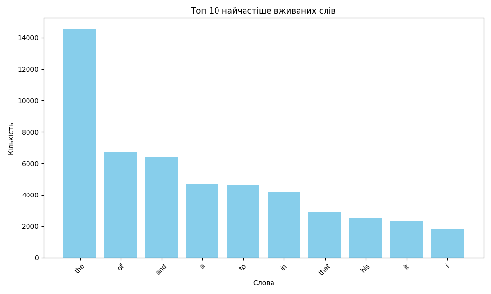

# Homework for the Module "Asynchronous Processing"

## Technical Task Description

The homework consists of two independent tasks.

---

### Task 1

Write a Python script that reads all files in a user-specified source folder and organizes them into subfolders in a target folder based on their file extensions. The script must perform sorting asynchronously to efficiently handle a large number of files.

#### Step-by-Step Instructions

1. Import the necessary asynchronous libraries.
2. Create an `ArgumentParser` object to handle command-line arguments.
3. Add the required arguments for defining the source and target folders.
4. Initialize asynchronous paths for the source and target directories.
5. Write an asynchronous function `read_folder` that recursively reads all files in the source folder and its subfolders.
6. Write an asynchronous function `copy_file` that copies each file to the corresponding subfolder in the target folder based on its file extension.
7. Set up error logging.
8. Run the asynchronous `read_folder` function in the main block.

**Acceptance Criteria**

- The code performs asynchronous reading and copying of files.
- Files are organized into subfolders based on their extensions.
- The program processes command-line arguments.
- All errors are logged.
- The code is readable and adheres to PEP 8 standards.

---

### Task 2

Write a Python script that downloads text from a given URL, analyzes word frequency in the text using the MapReduce paradigm, and visualizes the top words with the highest frequency.

#### Step-by-Step Instructions

1. Import the necessary modules (e.g., `matplotlib` and others).
2. Use the MapReduce implementation from the lecture notes.
3. Create a `visualize_top_words` function for visualizing the results.
4. In the main code block:

- Fetch the text from the given URL.
- Apply MapReduce to analyze word frequency.
- Visualize the results.

**Acceptance Criteria**

- The code fetches text from a given URL.
- It analyzes word frequency using MapReduce.
- The visualization displays top words by frequency.
- The code employs multithreading.
- The code is readable and adheres to PEP 8 standards.

